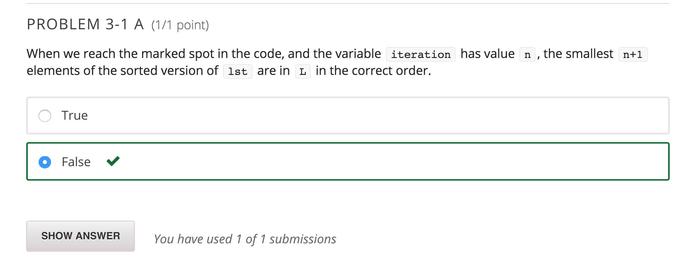

Below are four different functions for sorting a list of elements in increasing order. For simplicity, assume that the list only contains ints. For each, we are going to ask you about how the algorithm creates its output and about the worst case time complexity - or order of growth - of the algorithm. Answer the questions without running the code on your computer.

