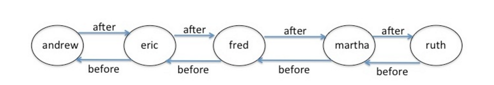

### PROBLEM 6-1  (10/10 points)

There are 2 coding problems on this page. Consider the following class definition:

    class Frob(object):
        def __init__(self, name):
            self.name = name
            self.before = None
            self.after = None
        def setBefore(self, before):
            # example: a.setBefore(b) sets b before a
            self.before = before
        def setAfter(self, after):
            # example: a.setAfter(b) sets b after a
            self.after = after
        def getBefore(self):
            return self.before
        def getAfter(self):
            return self.after
        def myName(self):
            return self.name

A **Frob** is an object that has a name, and two connections or **links**: a "before" and an "after" link that are intended to point to other instances of objects.

We can use **Frobs** to form a data structure called a doubly linked list. In a **doubly linked list**, each element has the property that if element A has a "before" link to element B, then element B has an "after" link to element A. We want to create a doubly linked collection of **Frob** instances with the property that all **Frobs** with names that are alphabetically before a specific **Frob**'s name appear ordered along the "before" link, and all Frobs with names that are alphabetically after a specific **Frob**'s name appear ordered along the "after" link.

In other words, overall the chain will be sorted alphabetically. Here is an example:

    eric = Frob('eric')
    andrew = Frob('andrew')
    ruth = Frob('ruth')
    fred = Frob('fred')
    martha = Frob('martha')
    
    insert(eric, andrew)
    insert(eric, ruth)
    insert(eric, fred)
    insert(ruth, martha)

And here is a diagram of the resulting data structure:



Note that if a Frob is inserted with the same name as a pre-existing Frob, both names should be inserted in the final data structure (the exact ordering of the two identical Frobs does not matter). So in the above example, if we were to next execute the line insert(eric, Frob('martha')), we would expect the doubly linked list to have the elements in the following order: andrew - eric - fred - martha - martha - ruth.

Provide a definition for an insert function that will create an ordered doubly linked list. This function is defined outside of the class Frob, and takes two arguments: a Frob that is currently part of a doubly linked list, and a new Frob. The new Frob will not initially have any "before" or "after" links to other Frobs. The function should mutate the list to place the new Frob in the correct location, with the resulting doubly linked list having appropriate "before" and "after" links. Complete the following function definition:

    def insert(atMe, newFrob):
        """
        atMe: a Frob that is part of a doubly linked list
        newFrob:  a Frob with no links 
        This procedure appropriately inserts newFrob into the linked list that atMe is a part of.    
        """

Please try the problem first without looking at the hints.

```python
def insert(atMe, newFrob):
    """
    atMe: a Frob that is part of a doubly linked list
    newFrob:  a Frob with no links 
    This procedure appropriately inserts newFrob into the linked list that atMe is a part of.    
    """
    # Your Code Here
    
    f1 = atMe
    f2 = newFrob
    n1 = f1.myName()
    n2 = f2.myName()
    #print
    #print 'n1 = '+n1+'  n2 = '+n2,
    
    if n1 <= n2:
        #print '  n1 <= n2'
        if f1.getAfter() == None:
            #print '  f1.getAfter() == None'
            f1.setAfter(f2)
            f2.setBefore(f1)
        else:
            while n1 <= n2 and f1.getAfter() != None:  
                #print ' n1: '+n1+' <=  n2: '+n2  
                f1 = f1.getAfter()
                n1 = f1.myName()
            if n1 > n2:
                #print ' n1: '+n1+' > n2: '+n2
                f1 = f1.getBefore()
            if f1.getAfter() == None:
                f1.setAfter(f2)
                f2.setBefore(f1)
            else:       
                t = f1.getAfter()                
                f1.setAfter(f2)
                f2.setBefore(f1)
                f2.setAfter(t)
                t.setBefore(f2)   
                
    else:
        #print '  n1 > n2'
        if f1.getBefore() == None:
            #print '*'
            t =  f1
            f1 = f2
            f2 = t
            f1.setAfter(f2)
            f2.setBefore(f1)      
        else:
            #print '**'
            while n1 > n2 and f1.getBefore() != None:
                #print '***'
                f1 = f1.getBefore()
                n1 = f1.myName()
            #print ' n1: '+n1+'  n2: '+n2    
            if n1 > n2:
                t = f1
                f1 = f2
                f2 = t
                f1.setAfter(f2)
                f2.setBefore(f1)
            else:             
                t = f1.getAfter()                
                f1.setAfter(f2)
                f2.setBefore(f1)
                f2.setAfter(t)
                t.setBefore(f2)
```

	Correct

### PROBLEM 6-2  (10/10 points)

Now assume that you have a working insert procedure. Starting with any Frob in a doubly linked list, we would like to find the "front" Frob, i.e., the one whose name is closest to the beginning of the alphabet. Write a recursive function called findFront to do this. findFront should take as an argument any Frob that is part of a doubly linked list.

```python
def findFront(frob):
    if frob.getBefore() == None:
        return frob
    else:
        return findFront(frob.getBefore())            

```

	Correct


