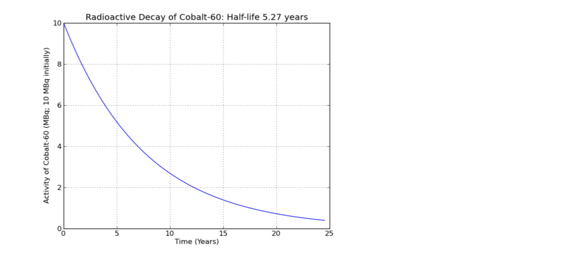
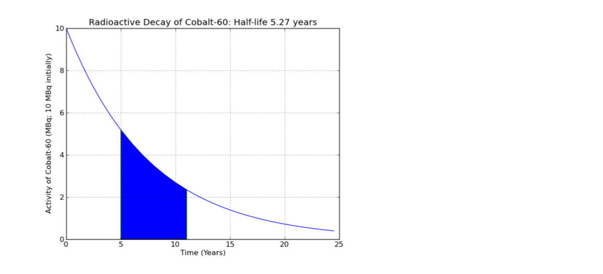

# Problem Set 3

### RADIATION EXPOSURE  (25/25 points)

"Radioactive decay" is the process by which an unstable atom loses energy and emits ionizing particles - what is commonly refered to as radiation. Exposure to radiation can be dangerous and is very important to measure to ensure that one is not exposed to too terribly much of it.

The radioactivity of a material decreases over time, as the material decays. A radioactive decay curve describes this decay. The x-axis measures time, and the y-axis measures the amount of activity produced by the radioactive sample. 'Activity' is defined as the rate at which the nuclei within the sample undergo transititions - put simply, this measures how much radiation is emitted at any one point in time. The measurement of activity is called the Becquerel (Bq). Here is a sample radioactive decay curve:



Now here's the problem we'd like to solve. Let's say Sarina has moved into a new apartment. Unbeknownst to her, there is a sample of Cobalt-60 inside one of the walls of the apartment. Initially that sample had 10 MBq of activity, but she moves in after the sample has been there for 5 years. She lives in the apartment for 6 years, then leaves. How much radiation was she exposed to?

We can actually figure this out using the radioactive decay curve from above. What we want to know is her total *radiation exposure* from year 5 to year 11.


Total radiation exposure corresponds to the area between the two green lines at time = 5 and time = 11, and under the blue radioactive decay curve. This should make intuitive sense - if the x axis measures time, and the y axis measures activity, then the area under the curve measures (time * activity) = MBq*years, or, approximately the total number of MBq Sarina was exposed to in her time in the radioactive apartment (technically, this result is the combination of gamma rays and beta particles she was exposed to, but this gets a bit complicated, so we'll ignore it. Sorry, physicists!).



So far, so good. But, how do we calculate this? Unlike a simple shape - say a square, or a circle - we have no easy way to tell what the area under this curve is.

However, we have learned a technique that can help us here - approximation. Let's use an approximation algorithm to estimate the area under this curve! We'll do so by first splitting up the area into equally-sized rectangles (in this case, six of them, one rectangle per year):


Once we've done that, we can figure out the area of each rectangle pretty easily. Recall that the area of a rectangle is found by multiplying the height of the rectangle by its width. The height of this rectangle:


is the value of the curve at 5.0. If the curve is described by a function, f, we can obtain the value of the curve by asking for f(5.0).

	f(5.0) = 5.181

The width of the rectangle is 1.0. So the area of this single rectangle is 1.0*5.181 = 5.181. To approximate how much radiation Sarina was exposed to, we next calculate the area of each successive rectangle and then sum up the areas of each rectangle to get the total. When we do this, we find that Sarina was exposed to nearly 23 MBq of radiation (technically, her apartment was bombarded by 23e6 * 3.154e6 = 7.25e13 neutrons, for those interested...).

Whether or not this will kill Sarina depends exactly on the type of radiation she was exposed to (see [this link](http://news.mit.edu/2011/explained-radioactivity-0328 "this link") which discusses more about the ways of measuring radiation). Either way, she should probably ask her landlord for a substantial refund.

In this problem, you are asked to find the amount of radiation a person is exposed to during some period of time by completing the following function:

	def radiationExposure(start, stop, step):
    '''
    Computes and returns the amount of radiation exposed
    to between the start and stop times. Calls the 
    function f (defined for you in the grading script)
    to obtain the value of the function at any point.
 
    start: integer, the time at which exposure begins
    stop: integer, the time at which exposure ends
    step: float, the width of each rectangle. You can assume that
      the step size will always partition the space evenly.

    returns: float, the amount of radiation exposed to 
      between start and stop times.
    '''

To complete this function you'll need to know what the value of the radioactive decay curve is at various points. There is a function f that will be defined for you that you can call from within your function that describes the radioactive decay curve for the problem. Do not define f in your code.

You should implement this function on your own machine. Open a new Canopy Python file and title it "radiationExposure.py". Complete your work inside this file. Test your code well in Canopy, and when you are convinced it is correct, cut and paste your definition into this tutor window.

```python
def radiationExposure(start, stop, step):
    '''
    Computes and returns the amount of radiation exposed
    to between the start and stop times. Calls the 
    function f (defined for you in the grading script)
    to obtain the value of the function at any point.
 
    start: integer, the time at which exposure begins
    stop: integer, the time at which exposure ends
    step: float, the width of each rectangle. You can assume that
      the step size will always partition the space evenly.

    returns: float, the amount of radiation exposed to 
      between start and stop times.
    '''
    # FILL IN YOUR CODE HERE...
    n = int((stop-start)/step)
    sum = 0.0
    x = 0.0
    #print 'n: '+ str(n)
    for i in range(n):
        x = start+step*i
        sum += step*f(x)
        
    return sum
        

```

	Correct
---

