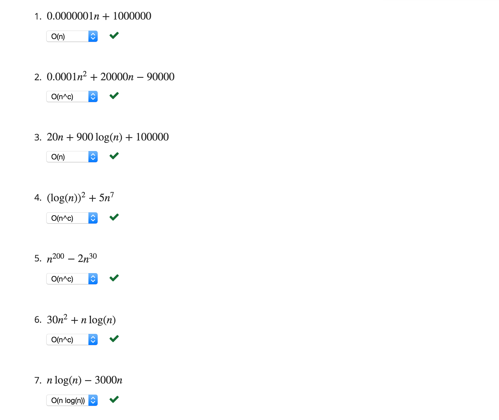
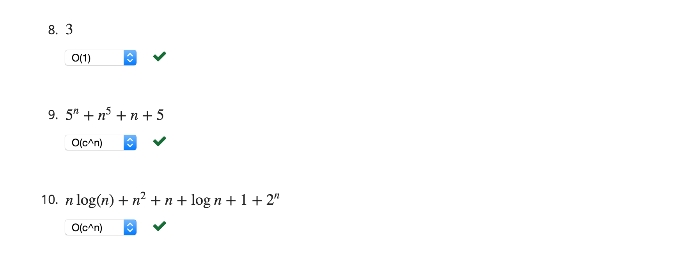

### PROBLEM 3  (10/10 points)

For each of the following expressions, select the order of growth class that best describes it from the following list: O(1),O(log(n)),O(n),O(nlog(n)),O(nc) or O(cn). Assume c is some constant.

Clicking Check will grade ALL the sub-problems. You have 2 attempts for this problem.

