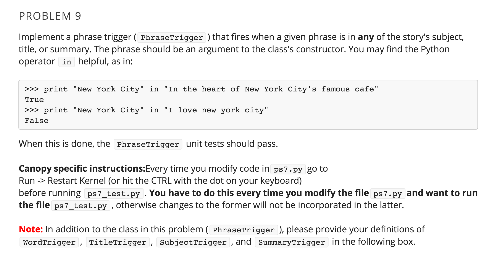

# Problem Set 7

### Conflict with Grader

To avoid getting an error from the grader about using the class variables title, subject, or summary, rename any variable you have used with these names to something else. Thank you!

---

### PART 2: TRIGGERS (PHRASETRIGGERS)  (5/5 points)




```python
# Enter your code for WordTrigger, TitleTrigger,
# SubjectTrigger, SummaryTrigger, and PhraseTrigger in this box
import string

class WordTrigger(Trigger):
    def __init__(self, word):
        self.word = word        
    def isWordIn(self, text):
        w = self.word.lower()
        text = text.lower()
        for char in text:
            if char in string.punctuation:
                text = text.replace(char,' ')               
        textList = text.split()
        if w in textList:
            return True
        else:
            return False
            
class TitleTrigger(WordTrigger):
    def evaluate(self, story):
        return self.isWordIn(story.getTitle())
        
class SubjectTrigger(WordTrigger):
    def evaluate(self, story):
        return self.isWordIn(story.getSubject())

class SummaryTrigger(WordTrigger):
    def evaluate(self, story):
        return self.isWordIn(story.getSummary())
                
class PhraseTrigger(Trigger):
    def __init__(self, phrase):
        self.phrase = phrase    
    def evaluate(self, story):
        p = self.phrase
        pInSubject = p in story.getSubject()
        pInSummary = p in story.getSummary()
        pInTitle = p in story.getTitle()        
        if pInSubject or pInSummary or pInTitle:       
            return True
        else:
            return False
        
        
```

	Correct
