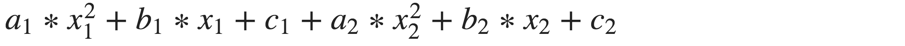

### PROBLEM 4 - PART 1  (5/5 points)

Write a Python function, evalQuadratic(a, b, c, x), that returns the value of the quadratic a(x^2) + b(x) + c.

This function takes in four numbers and returns a single number.

```python
def evalQuadratic(a, b, c, x):
    '''
    a, b, c: numerical values for the coefficients of a quadratic equation
    x: numerical value at which to evaluate the quadratic.
    '''
    ans = a*(x**2)+b*x+c
    return ans

```

	Correct

---

### PROBLEM 4 - PART 2  (5/5 points)

Write a Python function, twoQuadratics, that takes in two sets of coefficients and x-values and prints the sum of the results of evaluating two quadratic equations. It does not do anything else. That is, you should evaluate and print the result of the following equation:



You should use the evalQuadratic function you defined in the "Quadratic" problem of these exercises (you don't need to redefine evalQuadratic in this box; when you call evalQuadratic, our definition will be used).

    def twoQuadratics(a1, b1, c1, x1, a2, b2, c2, x2):
        '''
        a1, b1, c1: one set of coefficients of a quadratic equation
        a2, b2, c2: another set of coefficients of a quadratic equation
        x1, x2: values at which to evaluate the quadratics
        '''
      # Your code here  

If you are getting this problem incorrect, re-read the problem statement carefully.

```python
def twoQuadratics(a1, b1, c1, x1, a2, b2, c2, x2):
    '''
    a1, b1, c1: one set of coefficients of a quadratic equation
    a2, b2, c2: another set of coefficients of a quadratic equation
    x1, x2: values at which to evaluate the quadratics
    '''
    print evalQuadratic(a1, b1, c1, x1) + evalQuadratic(a2, b2, c2, x2)  
           
```

	Correct
	

